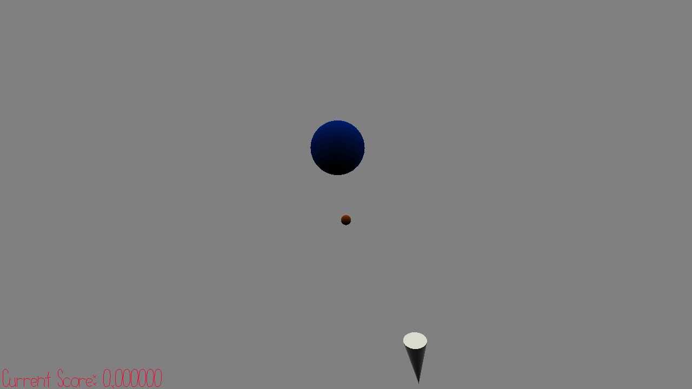

# Airshot Trainer

Author: pbhuang

Design: I really like playing tf2 and playing soldier because of those sweet airshots (hitting enemies in the air with a direct
rocket). So this game is all about how many projectiles you can hit with your straight shooting rocket in 60 seconds. Hitting the targets sooner to when it was shot up into the air will give you more score. Finally, this game is different from stuff in tf2 and incorporates the walkmesh by generating a "bonus" rectangle every few seconds. If your
player walks to the red bonus rectangle and stands on it when shooting, they will receive more score if it his the target!

This was not my original game idea that I had submitted (somewhat similar but different), but lack of time and having so much other stuff
to do made me have to constrain to this as it was easier to understand how to implement all the needed parts. The main bottleneck from being
more creative is blender because I really still don't know how to create good models for my games.

How To Play:

WASD: move
LMB: shoot
Mouse: aim

All audio and models created by me. SFX created on [Ableton](https://learningsynths.ableton.com/en/playground)

This game was built with [NEST](NEST.md).

